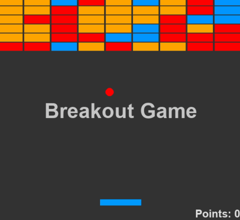

# Python Breakout Game

This popular game is made with pygame where the player controls the paddle as the ball bounces and break a wall of bricks. The purpose is to remove all the bricks without letting the ball fall off the paddle and onto the edge on the screen. To start, use the arrows to move the paddle from left to right. Once the game is over, click R to restart and Q to quit the game. 

# Game Requirements
- PyGame
- Python 3.x
- Virtual Environment 

# Run Applications
- `git clone` 
- `cd breakout` 
- run the pygame

 
